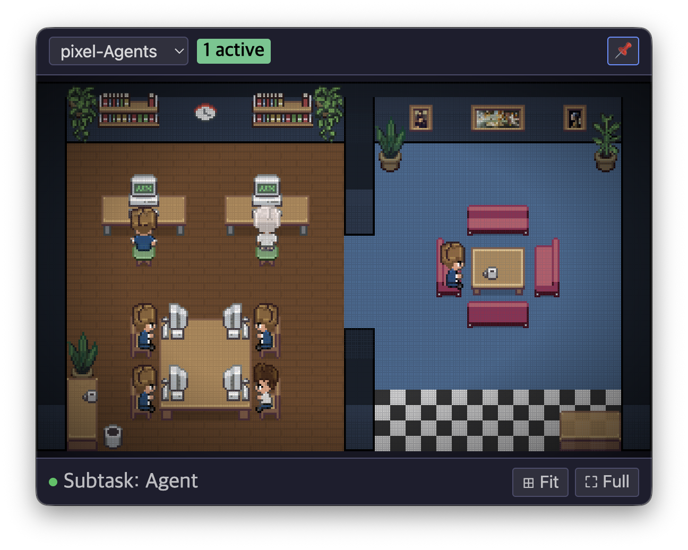

# Pixel Agents Menubar

A standalone macOS menubar app that visualizes your Claude Code agent activity as pixel-art characters working in a virtual office.
> Claude Code 에이전트 활동을 픽셀아트 캐릭터로 시각화하는 macOS 메뉴바 독립 앱입니다.



## What is this?

This app is built for **Claude Desktop App** users who want to see their Claude Code agents visualized as animated pixel-art characters. When you run Claude Code through the Claude Desktop App, each agent appears as a character sitting at a desk, typing, reading, or wandering around a pixel-art office.
> 이 앱은 **Claude Desktop App** 사용자를 위해 만들어졌습니다. Claude Desktop App을 통해 Claude Code를 실행하면, 각 에이전트가 픽셀아트 오피스에서 책상에 앉아 타이핑하거나, 읽거나, 돌아다니는 캐릭터로 나타납니다.

Sub-agents spawned during tasks also appear as separate characters with distinct appearances, sitting at available workstations.
> 작업 중 생성된 서브에이전트도 고유한 외형의 별도 캐릭터로 나타나 빈 워크스테이션에 앉습니다.

## Features

- **macOS Menubar Tray App** -- Lives in your menubar, click to see the pixel office
  > 메뉴바에 상주하며, 클릭하면 픽셀 오피스가 보입니다
- **Real-time Agent Detection** -- Automatically discovers active Claude Code sessions
  > 활성 Claude Code 세션을 자동으로 감지합니다
- **Animated Characters** -- Agents type, read, walk, and idle with pixel-art animations
  > 에이전트가 타이핑, 읽기, 걷기, 대기 등 픽셀아트 애니메이션으로 표현됩니다
- **Sub-agent Visualization** -- Sub-agents appear as distinct characters at PC desks
  > 서브에이전트가 PC 데스크에 고유한 캐릭터로 나타납니다
- **Pin Window** -- Keep the office visible while working in other apps
  > 다른 앱을 사용하면서도 오피스 창을 고정할 수 있습니다
- **Fit / Full Screen** -- Auto-fit office to window, native macOS fullscreen support
  > 오피스를 창에 맞추거나, macOS 전체화면을 지원합니다
- **Project Selector** -- Switch between multiple Claude Code projects
  > 여러 Claude Code 프로젝트 간 전환이 가능합니다
- **Mouse Controls** -- Scroll to zoom, drag to pan
  > 스크롤로 확대/축소, 드래그로 이동합니다
- **Diverse Characters** -- Each agent gets a unique appearance (6 palettes + hue shift)
  > 각 에이전트가 고유한 외형을 가집니다 (6가지 팔레트 + 색상 변환)
- **Stable Appearance** -- Same agent keeps the same look across project switches
  > 프로젝트를 전환해도 같은 에이전트는 같은 모습을 유지합니다

## Installation
> 설치 방법

### From Source
> 소스코드에서 빌드

```bash
git clone https://github.com/Tyne-kr/pixel-agents-menubar.git
cd pixel-agents-menubar
npm install
npm run build
npm start
```

### As Built App
> 빌드된 앱으로 설치

Download `Pixel Agents.app` from the [Releases](../../releases) page and drag it to your Applications folder.
> [Releases](../../releases) 페이지에서 `Pixel Agents.app`을 다운로드하고 Applications 폴더로 드래그하세요.

> **Important / 중요:**
>
> This app is not signed with an Apple Developer certificate. On first launch, macOS will show a warning saying the app is from an "unidentified developer." To open it:
>
> 이 앱은 Apple 개발자 인증서로 서명되지 않았습니다. 처음 실행 시 macOS에서 "확인되지 않은 개발자" 경고가 표시됩니다. 열려면:
>
> 1. Right-click (or Ctrl+click) the app / 앱을 우클릭 (또는 Ctrl+클릭)
> 2. Select "Open" from the context menu / 컨텍스트 메뉴에서 "열기" 선택
> 3. Click "Open" in the dialog / 대화상자에서 "열기" 클릭
>
> Alternatively, go to System Settings > Privacy & Security > scroll down and click "Open Anyway."
>
> 또는 시스템 설정 > 개인정보 보호 및 보안 > 아래로 스크롤하여 "그래도 열기"를 클릭하세요.
>
> We plan to register as an Apple Developer in the future to eliminate this warning.
>
> 향후 Apple 개발자로 등록하여 이 경고를 없앨 계획입니다.

## How It Works
> 작동 원리

The app monitors `~/.claude/projects/` for JSONL session files created by Claude Code. It reads only tool names and IDs from these files (never your actual code or conversations) and translates agent activity into character animations:
> 이 앱은 Claude Code가 생성한 JSONL 세션 파일을 `~/.claude/projects/`에서 모니터링합니다. 파일에서 도구 이름과 ID만 읽으며 (실제 코드나 대화 내용은 절대 읽지 않습니다), 에이전트 활동을 캐릭터 애니메이션으로 변환합니다:

| Agent Activity / 에이전트 활동 | Character Animation / 캐릭터 애니메이션 |
|------|------|
| Using Read, Grep, Glob, WebSearch, WebFetch | Reading (looking at book) / 읽기 (책 보기) |
| Using Edit, Write, Bash, Agent | Typing (at keyboard) / 타이핑 (키보드 입력) |
| Idle (between turns) / 대기 (턴 사이) | Walking around the office / 오피스를 돌아다님 |
| Sub-agent spawned / 서브에이전트 생성 | New character appears at a desk / 새 캐릭터가 데스크에 나타남 |
| Sub-agent completed / 서브에이전트 완료 | Character despawns (matrix effect) / 캐릭터가 사라짐 (매트릭스 이펙트) |

## Requirements
> 요구 사항

- macOS 11.0 (Big Sur) or later / macOS 11.0 (Big Sur) 이상
- Claude Code running via Claude Desktop App / Claude Desktop App을 통해 실행되는 Claude Code
- Currently built for Apple Silicon (arm64). Intel Mac users can build from source.
  > 현재 Apple Silicon (arm64) 전용 빌드입니다. Intel Mac 사용자는 소스에서 빌드할 수 있습니다.

## Privacy
> 개인정보 보호

This app is completely offline and privacy-respecting:
> 이 앱은 완전히 오프라인이며 개인정보를 존중합니다:

- **No network calls** -- zero outbound connections / 네트워크 호출 없음
- **No telemetry** -- no analytics or tracking / 원격 측정 없음 -- 분석이나 추적 없음
- **No code reading** -- only reads tool names/IDs from JSONL, never your code / 코드 읽기 없음 -- JSONL에서 도구 이름/ID만 읽음
- **No data storage** -- only saves character palette preferences in localStorage / 데이터 저장 없음 -- 캐릭터 팔레트 설정만 저장
- **Read-only** -- never writes to any file outside its own directory / 읽기 전용 -- 자체 디렉토리 외부에 쓰지 않음

## Known Limitations
> 알려진 제한 사항

- Sub-agent characters stay visible for a minimum of 15 seconds for visual enjoyment, even if the sub-agent completes faster
  > 서브에이전트 캐릭터는 시각적 즐거움을 위해 최소 15초간 표시됩니다 (더 빨리 완료되어도)
- The app currently only builds for Apple Silicon (arm64). Intel Mac support can be added by modifying the build config
  > 현재 Apple Silicon (arm64) 전용 빌드입니다. 빌드 설정 변경으로 Intel Mac 지원 추가 가능
- Without Apple Developer signing, macOS shows a security warning on first launch
  > Apple 개발자 서명 없이, macOS에서 첫 실행 시 보안 경고가 표시됩니다

## Future Plans
> 향후 계획

- Bug fixes as they are discovered -- we will make our best effort to address reported issues
  > 발견되는 버그 수정 -- 보고된 문제를 해결하기 위해 최선을 다하겠습니다
- Potential Apple Developer signing for seamless installation
  > 원활한 설치를 위한 Apple 개발자 서명 등록 가능성
- Intel Mac (x64) / Universal binary support
  > Intel Mac (x64) / 유니버설 바이너리 지원
- Possible UX enhancements (character social interactions, conversation bubbles)
  > UX 개선 가능성 (캐릭터 간 상호작용, 대화 말풍선)

---

## Development History
> 개발 히스토리

This project was developed in a single intensive session, porting the original VS Code extension to a standalone Electron menubar app. Below is a detailed account of every bug encountered and how it was resolved.
> 이 프로젝트는 원본 VS Code 확장을 독립 Electron 메뉴바 앱으로 포팅하면서 하나의 집중 세션에서 개발되었습니다. 아래는 발견된 모든 버그와 해결 방법의 상세한 기록입니다.

### Bug Fix History
> 버그 수정 히스토리

#### 1. Assets Not Loading -- "Loading..." Screen
> 에셋 미로딩 -- "Loading..." 화면

**Problem:** The pixel office showed "Loading..." indefinitely.
> **문제:** 픽셀 오피스가 무한히 "Loading..."을 표시함.

**Root Cause:** The preload script injected `acquireVsCodeApi`, causing the renderer to wait for VS Code extension messages that never came.
> **원인:** preload 스크립트가 `acquireVsCodeApi`를 주입하여, 렌더러가 오지 않는 VS Code 확장 메시지를 기다림.

**Fix:** Removed VS Code API injection; used browser mock mode for asset loading via `file://` protocol.
> **수정:** VS Code API 주입 제거; `file://` 프로토콜을 통한 브라우저 모드로 에셋 로딩.

#### 2. Agent Characters Not Appearing
> 에이전트 캐릭터 미표시

**Problem:** Office rendered with furniture but no agent characters.
> **문제:** 가구는 렌더링되나 에이전트 캐릭터가 나타나지 않음.

**Root Cause:** `agentCreated` IPC message was sent before React mounted, so the message was lost.
> **원인:** React 마운트 전에 `agentCreated` IPC 메시지가 전송되어 메시지가 소실됨.

**Fix:** Added message buffering in preload.ts -- messages are queued until `onMessage` callback is registered, then replayed.
> **수정:** preload.ts에 메시지 버퍼링 추가 -- `onMessage` 콜백 등록까지 메시지를 대기열에 넣고 이후 재생.

#### 3. Mouse Drag Not Releasing
> 마우스 드래그 해제 안 됨

**Problem:** Click-drag to pan worked, but releasing the mouse button didn't stop dragging.
> **문제:** 클릭 드래그로 이동은 되나, 마우스 버튼을 놓아도 드래그가 멈추지 않음.

**Fix:** Added `window.addEventListener('mouseup')` global handler to catch mouse releases outside the canvas.
> **수정:** 캔버스 외부의 마우스 릴리스를 잡기 위해 전역 핸들러 추가.

#### 4. Canvas Zoom Too Aggressive
> 캔버스 줌 배율 과도

**Problem:** Mouse wheel zoom steps were too large, making fine control impossible.
> **문제:** 마우스 휠 줌 단계가 너무 커서 세밀한 조작이 불가능함.

**Fix:** Reduced zoom step to 0.1 per wheel tick.
> **수정:** 휠 틱당 줌 단계를 0.1로 줄임.

#### 5. Font Size Inconsistency
> 폰트 크기 불일치

**Problem:** UI elements had mixed font sizes (13px to 20px), making some text barely readable.
> **문제:** UI 요소의 폰트 크기가 혼재(13px~20px)하여 일부 텍스트가 거의 읽히지 않음.

**Fix:** Standardized all UI text to 16-20px range.
> **수정:** 모든 UI 텍스트를 16-20px 범위로 통일.

#### 6. Window Appearing at (0,0) on First Launch
> 첫 실행 시 창이 (0,0) 위치에 나타남

**Problem:** App window appeared at the bottom-left corner of the screen on first launch.
> **문제:** 첫 실행 시 앱 창이 화면 좌측 하단에 나타남.

**Root Cause:** `ready-to-show` event fired before tray icon was created, so `getPopoverPosition()` returned `{x: 0, y: 0}`.
> **원인:** 트레이 아이콘 생성 전에 `ready-to-show` 이벤트가 발생하여 위치가 (0, 0)으로 반환.

**Fix:** Removed auto-show on `ready-to-show`; window only appears when tray icon is clicked. Added fallback position (center of primary display) if tray is unavailable.
> **수정:** 자동 표시 제거; 트레이 아이콘 클릭 시에만 창 표시. 트레이 미사용 시 화면 중앙으로 폴백.

#### 7. Global ESC Key Capture
> 전역 ESC 키 캡처

**Problem:** `globalShortcut.register('Escape')` captured the Escape key system-wide, breaking it in all other apps.
> **문제:** 시스템 전체에서 ESC 키를 캡처하여 다른 모든 앱에서 사용 불가.

**Fix:** Replaced with `webContents.on('before-input-event')` -- window-scoped, only active during fullscreen.
> **수정:** 윈도우 범위의 `before-input-event`로 교체, 전체화면 시에만 활성.

#### 8. File Descriptor Leak
> 파일 디스크립터 누수

**Problem:** If `fs.readSync` threw an error in the file watcher, the file descriptor was never closed.
> **문제:** 파일 워처에서 에러 시 파일 디스크립터가 닫히지 않음.

**Fix:** Wrapped in `try/finally` to guarantee `fs.closeSync(fd)`.
> **수정:** `try/finally`로 감싸 `fs.closeSync(fd)` 보장.

#### 9. Path Traversal in Protocol Handler
> 프로토콜 핸들러의 경로 탐색 취약점

**Problem:** The custom `pixel-agents://` protocol handler didn't validate file paths, allowing potential directory traversal attacks.
> **문제:** 커스텀 프로토콜 핸들러가 파일 경로를 검증하지 않아 디렉토리 탐색 공격 가능성.

**Fix:** Added `path.resolve()` + `startsWith(webviewDir)` guard, returning 403 Forbidden for out-of-bounds requests.
> **수정:** 경로 검증 가드 추가, 범위 밖 요청에 403 Forbidden 반환.

#### 10. Agent Appearance Changing on Project Switch
> 프로젝트 전환 시 에이전트 외형 변경

**Problem:** Switching projects in the dropdown and switching back gave agents different character appearances.
> **문제:** 프로젝트를 전환했다가 돌아오면 에이전트 캐릭터 외형이 바뀜.

**Root Cause:** Agent IDs were generated by an incrementing counter, so re-discovered sessions got new IDs and different palette assignments.
> **원인:** 에이전트 ID가 증가 카운터로 생성되어, 재발견된 세션이 새 ID와 다른 팔레트를 받음.

**Fix:** Implemented `stableIdFromPath()` using djb2 hash of session file path for deterministic IDs. Added localStorage persistence for palette/seat assignments.
> **수정:** 세션 파일 경로의 해시를 사용한 결정적 ID 생성. localStorage에 팔레트/좌석 지속성 추가.

#### 11. Sub-agents Clustering in Lounge Area
> 서브에이전트가 라운지 영역에 집중

**Problem:** Sub-agent characters sat on sofas and lounge chairs instead of at PC desks.
> **문제:** 서브에이전트 캐릭터가 PC 데스크 대신 소파와 라운지 의자에 앉음.

**Root Cause:** Multiple failed attempts at custom seat-finding logic. `COFFEE_TABLE` and `SMALL_TABLE` had `isDesk: true`, causing lounge seats to be treated as work seats.
> **원인:** 커스텀 좌석 찾기 로직의 여러 번 실패. 라운지 테이블이 작업 테이블로 취급됨.

**Fix:** Used the existing `findFreeSeat()` method (which already prioritizes PC-facing seats via ray-casting for electronics) instead of writing custom logic. **This was the key lesson of the project -- reuse proven existing functions before writing new ones.**
> **수정:** 커스텀 로직 대신 기존 `findFreeSeat()` 메서드 사용. **이것이 프로젝트의 핵심 교훈 -- 새 코드를 작성하기 전에 검증된 기존 함수를 재사용하라.**

#### 12. Sub-agents Never Disappearing
> 서브에이전트가 사라지지 않음

**Problem:** Sub-agent characters stayed in the office indefinitely after their tasks completed.
> **문제:** 서브에이전트 캐릭터가 작업 완료 후에도 오피스에 무한히 남아있음.

**Root Cause:** `tool_result` records in JSONL are nested inside `"type": "user"` messages. The parser was checking `record.type === 'tool_result'` at the top level, which never matched.
> **원인:** JSONL의 `tool_result`가 `"type": "user"` 메시지 내부에 중첩. 파서가 최상위에서 확인하여 매칭 안 됨.

**Fix:** Parse `tool_result` from within `user` message `content[]` arrays, mirroring how `tool_use` is parsed from `assistant` message `content[]`.
> **수정:** `tool_use` 파싱 방식과 동일하게 `user` 메시지 `content[]` 내부에서 `tool_result` 파싱.

#### 13. Agents Never Going Idle
> 에이전트가 idle 상태로 전환되지 않음

**Problem:** Agents never transitioned to idle status when a turn completed.
> **문제:** 턴이 완료되어도 에이전트가 idle 상태로 전환되지 않음.

**Root Cause:** The code checked for `subtype === 'turn_duration'` which doesn't exist in the JSONL. The actual subtype is `'stop_hook_summary'`.
> **원인:** JSONL에 존재하지 않는 `'turn_duration'` 확인. 실제 subtype은 `'stop_hook_summary'`.

**Fix:** Changed the subtype check to match the real JSONL format.
> **수정:** 실제 JSONL 형식에 맞게 subtype 확인 변경.

#### 14. Sub-agents Disappearing Too Quickly
> 서브에이전트가 너무 빨리 사라짐

**Problem:** Fast-completing sub-agents appeared and vanished within the same polling cycle (< 1 second), creating a jarring flash.
> **문제:** 빠르게 완료되는 서브에이전트가 1초 미만에 나타났다 사라져 깜빡임 발생.

**Fix:** Added a 15-second minimum display time. Sub-agent characters are tracked with a `createdAt` timestamp, and removal is delayed until at least 15 seconds have elapsed.
> **수정:** 15초 최소 표시 시간 추가. `createdAt` 타임스탬프 기록, 최소 15초 경과 후에만 제거.

#### 15. App Icon Not Showing
> 앱 아이콘 미표시

**Problem:** The built `.app` showed a generic Electron icon instead of the custom pixel art icon.
> **문제:** 빌드된 앱이 커스텀 픽셀아트 아이콘 대신 기본 Electron 아이콘을 표시.

**Root Cause:** The `.icns` file was missing the `512x512@2x` (1024x1024) variant required by macOS.
> **원인:** `.icns` 파일에 macOS가 요구하는 1024x1024 변형이 누락.

**Fix:** Regenerated the icon with all 10 required sizes. Cleared macOS icon cache.
> **수정:** 필요한 10가지 크기를 모두 포함하여 아이콘 재생성. macOS 아이콘 캐시 클리어.

### Architecture
> 아키텍처

```
Electron Main Process
  ├── Tray Icon (menubar)
  ├── AgentDiscovery (scans ~/.claude/projects/ every 10s)
  ├── FileWatcherManager (polls JSONL files every 500ms)
  └── IpcBridge (routes messages)
         │
    IPC / Preload Bridge
         │
React Renderer (Canvas)
  ├── MenubarShell (top bar + status bar + pin/fit/full)
  ├── OfficeCanvas (game loop + mouse/keyboard)
  ├── OfficeState (characters, furniture, seats)
  ├── Renderer (z-sorted canvas drawing)
  └── Characters FSM (type/idle/walk states)
```

### Data Flow
> 데이터 플로우

```
JSONL file → FileWatcherManager (poll) → IPC → Preload Bridge
→ window MessageEvent → useExtensionMessages → OfficeState
→ Game Loop → Canvas Renderer → Pixel Art Office
```

> JSONL 파일 → 파일워처 (폴링) → IPC → 프리로드 브릿지 → 윈도우 메시지 → 메시지 훅 → 오피스 상태 → 게임 루프 → 캔버스 렌더러 → 픽셀아트 오피스

---

## Credits & Acknowledgments
> 크레딧 및 감사의 말

This project is a standalone Electron port of the wonderful [**Pixel Agents**](https://github.com/pablodelucca/pixel-agents) VS Code extension.
> 이 프로젝트는 훌륭한 [**Pixel Agents**](https://github.com/pablodelucca/pixel-agents) VS Code 확장을 독립 Electron 앱으로 포팅한 것입니다.

**Huge thanks to [@pablodelucca](https://github.com/pablodelucca)** for creating the original Pixel Agents extension and open-sourcing it. The pixel art assets, character animations, office layout, rendering engine, and game loop are entirely his work. This project would not exist without his creative vision and generous open-source contribution.
> 원본 Pixel Agents 확장을 만들고 오픈소스로 공개해 주신 **[@pablodelucca](https://github.com/pablodelucca)**님께 깊은 감사를 드립니다. 픽셀아트 에셋, 캐릭터 애니메이션, 오피스 레이아웃, 렌더링 엔진, 게임 루프는 전적으로 그의 작품입니다. 그의 창의적 비전과 관대한 오픈소스 기여 없이는 이 프로젝트는 존재할 수 없었습니다.

The original extension brings joy to developers by turning the invisible work of AI coding agents into something you can actually watch and enjoy. We simply wanted to bring that same experience to Claude Desktop App users who don't use VS Code.
> 원본 확장은 AI 코딩 에이전트의 보이지 않는 작업을 실제로 보고 즐길 수 있는 것으로 바꾸어 개발자들에게 기쁨을 줍니다. 우리는 단순히 VS Code를 사용하지 않는 Claude Desktop App 사용자들에게 같은 경험을 가져다주고 싶었습니다.

### What we kept from the original
> 원본에서 유지한 것

- All pixel art assets (characters, furniture, floors, walls) / 모든 픽셀아트 에셋
- Character FSM (type/idle/walk state machine) / 캐릭터 상태 머신
- Canvas renderer (z-sorted scene drawing) / 캔버스 렌더러
- Office layout system (seats, furniture placement, tile map) / 오피스 레이아웃 시스템
- Game loop architecture / 게임 루프 아키텍처

### What we added for the Electron port
> Electron 포팅을 위해 추가한 것

- macOS menubar tray app with popover window / 팝오버 윈도우가 있는 메뉴바 트레이 앱
- Agent discovery via `~/.claude/projects/` JSONL monitoring / JSONL 모니터링을 통한 에이전트 발견
- JSONL file watcher with tool_use/tool_result parsing / tool_use/tool_result 파싱 파일 워처
- IPC bridge between Electron main process and React renderer / Electron과 React 간 IPC 브릿지
- Pin window feature (keep visible while using other apps) / 창 고정 기능
- Fit-to-screen and native fullscreen support / 화면 맞춤 및 전체화면 지원
- Stable agent IDs (hash-based) and appearance persistence / 안정적 에이전트 ID 및 외형 지속성
- Sub-agent desk assignment via `findFreeSeat()` / 서브에이전트 데스크 배치
- Diverse sub-agent palettes (improvement over original) / 다양한 서브에이전트 팔레트 (원본 대비 개선)
- 15-second minimum display time for sub-agents / 서브에이전트 15초 최소 표시 시간

### Special Thanks to gstack
> gstack에 대한 특별한 감사

A heartfelt thank you to **[@garrytan](https://github.com/garrytan)** and the [**gstack**](https://github.com/garrytan/gstack) project. As a complete beginner in app development, gstack made it possible for me to take this project from planning to QA through vibe coding with remarkable ease and confidence. The structured workflow -- from `/office-hours` for brainstorming, through `/review` for code review, to `/qa` for quality assurance -- guided the entire development process step by step. Without gstack, a novice like me could never have built, tested, and shipped a full Electron app in a single session. Thank you for making software development accessible to everyone.
> **[@garrytan](https://github.com/garrytan)**님과 [**gstack**](https://github.com/garrytan/gstack) 프로젝트에 진심 어린 감사를 드립니다. 앱 개발의 완전한 초보자로서, gstack 덕분에 바이브 코딩을 통해 이 프로젝트를 계획부터 QA까지 놀라울 정도로 쉽고 자신감 있게 진행할 수 있었습니다. 브레인스토밍을 위한 `/office-hours`부터, 코드 리뷰를 위한 `/review`, 품질 보증을 위한 `/qa`까지 구조화된 워크플로우가 전체 개발 과정을 단계별로 안내했습니다. gstack이 없었다면, 저 같은 초보자가 하나의 세션에서 완전한 Electron 앱을 빌드하고, 테스트하고, 출시하는 것은 절대 불가능했을 것입니다. 모든 사람이 소프트웨어 개발에 접근할 수 있게 해주셔서 감사합니다.

---

## License
> 라이선스

This project follows the same license as the original [pixel-agents](https://github.com/pablodelucca/pixel-agents) repository.
> 이 프로젝트는 원본 [pixel-agents](https://github.com/pablodelucca/pixel-agents) 저장소와 동일한 라이선스를 따릅니다.

Built with Claude Code (Opus 4.6) via Claude Desktop App, powered by [gstack](https://github.com/garrytan/gstack).
> Claude Desktop App을 통한 Claude Code (Opus 4.6)로 빌드, [gstack](https://github.com/garrytan/gstack)으로 구동.
